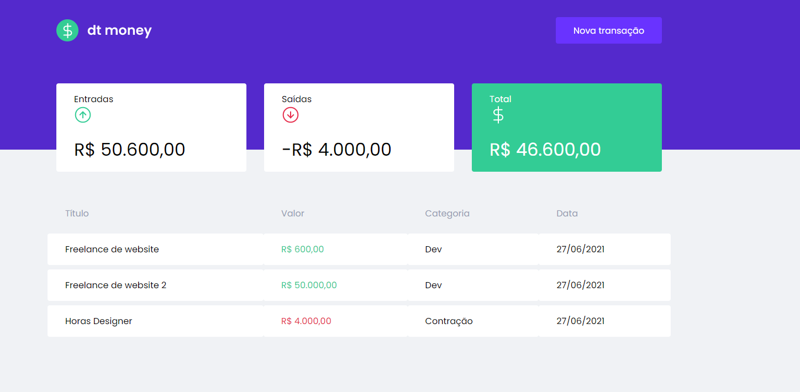
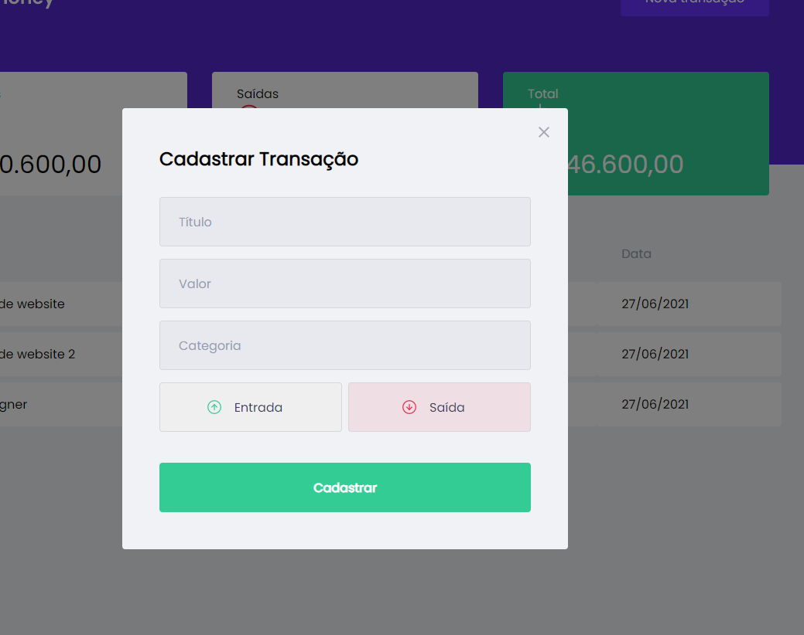

**DT-Money**
- Aplicação para fins de controle financeiro, desenvolvida durante o Ignite da Rockeatseat.

**Rodar o projeto**

Ao clonar o projeto abra o terminal e execute o comando:

`npm install`

`npm run start`

**O que foi utilizado no desenvolvimento deste projeto?**

- React.js
- Typescript
- Styled Components
- React Modal
- Context API
 
## Showcase

##### Homepage

##### Modal

